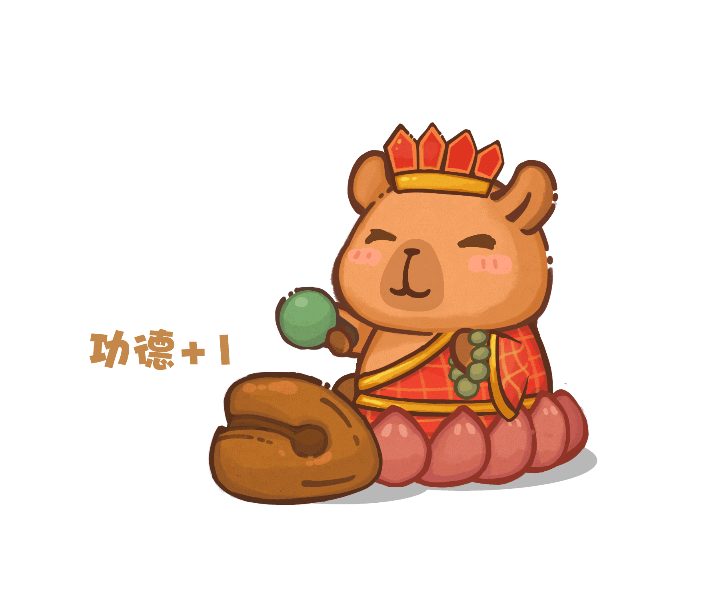
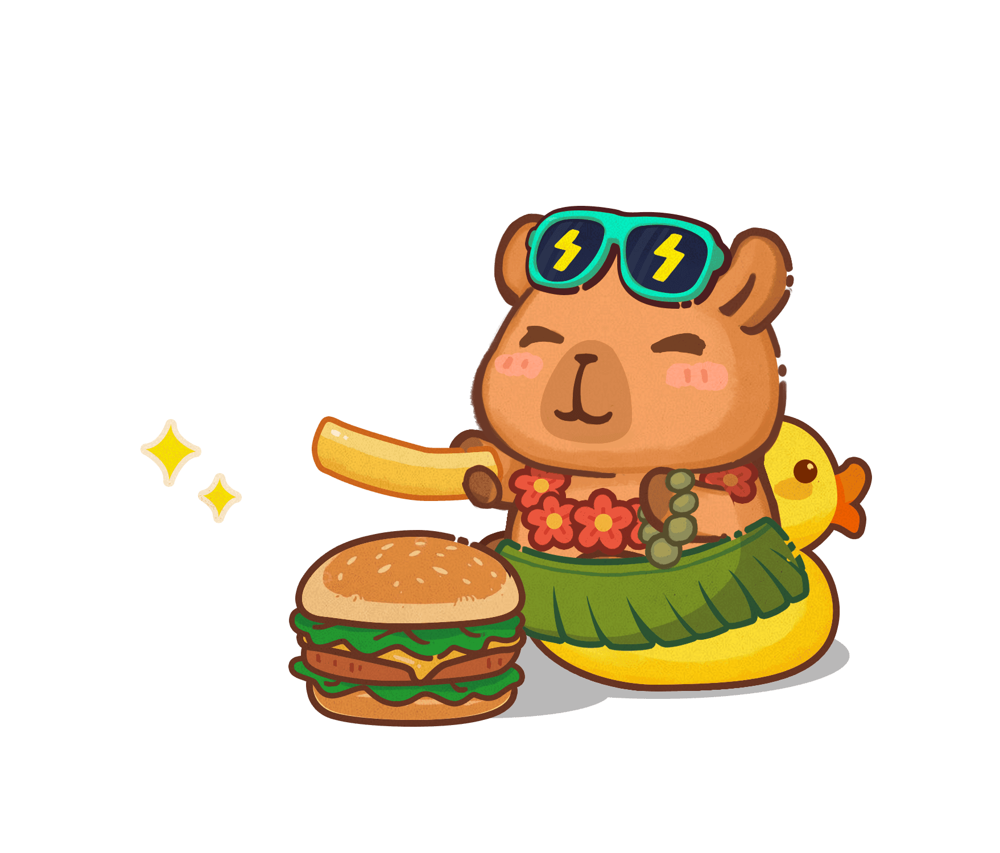
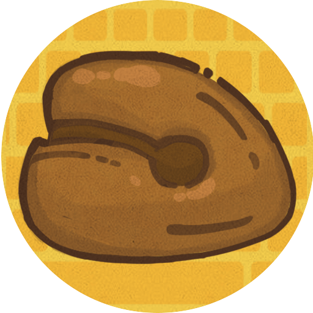

<div align="center">

# 🐾 敲好运 BongBongCapy 官网


**✨ 键盘敲击陪伴游戏的治愈官网 ✨**

[](https://capy.ybxqk.cn)
[](https://reactjs.org/)
[](https://typescriptlang.org/)
[](https://tailwindcss.com/)

[🌐 **访问官网**](https://capy.ybxqk.cn) | [📱 **下载游戏**](https://capy.ybxqk.cn#download) | [🎨 **查看截图**](#-游戏截图)

</div>

## 🎮 关于游戏

> **敲好运**（谐音"超好运"）是一款超治愈的卡皮巴拉键盘陪伴游戏


### ✨ 游戏特色

🐹 **超萌水豚伙伴** - 可爱的卡皮巴拉会跟随你的键盘敲击节奏一起工作  
💝 **功德许愿系统** - 在美丽的荷花池积攒功德，向水豚许下心愿  
👗 **丰富换装系统** - 收集各种奇珍异宝服装，打造独一无二的水豚  
☕ **完美工作伙伴** - 专为上班族和学生设计，边工作边养成  
🌸 **治愈系体验** - 偶尔偷懒卖萌，让工作充满温暖和好运  

## 🌐 在线体验

### 🔗 官网链接
**主站**: [capy.ybxqk.cn](https://capy.ybxqk.cn)

### 📱 多平台支持
- 🖥️ **Windows**: 支持 Windows 10/11
- 🍎 **macOS**: 支持 macOS 12+  
- 🐧 **Linux**: 即将推出

<div align="center">

</div>

## 🎨 游戏截图

<div align="center">

### 🐾 水豚换装秀
<div style="display: flex; flex-wrap: wrap; gap: 10px; justify-content: center;">
  
  
  
  
  
  
  
</div>

*从左到右：财神卡皮、功德大师、夏日摸鱼王、干饭水豚、开箱盲盒达人、新年发财豚、环保打工豚*

</div>

## 🛠️ 技术栈

<div align="center">

### 前端技术


### UI & 动画


### 国际化 & 分析


</div>

## 🚀 本地开发

### 📋 环境要求

- Node.js >= 16.0.0
- pnpm >= 8.0.0

### ⚡ 快速开始

```bash
# 克隆项目
git clone https://github.com/junejuneli/bongbongcapy.git
```

### 🔧 开发命令

```bash
# 开发服务器（自动打开浏览器）
pnpm run dev

# 代码检查
pnpm run lint

# 构建生产版本
pnpm run build

# 预览生产版本
pnpm run preview
```

## 📁 项目结构

```
home/
├── 🎨 public/                    # 静态资源
│   ├── images/                   # 游戏宣传图片
│   │   ├── skins/               # 游戏皮肤预览
│   │   ├── 主宣传图1232.jpg      # 主要宣传图
│   │   ├── 库主页3840.jpg        # 高清主页图
│   │   └── logo1280.png         # 游戏Logo
│   └── pet-item/                # 游戏引擎资源
├── 🔧 src/
│   ├── components/              # React 组件
│   │   ├── Navigation.tsx       # 🧭 导航栏
│   │   ├── Hero.tsx            
│   │   ├── Features.tsx        # ✨ 功能特色
│   │   ├── PetSkinShowcase.tsx # 🎭 皮肤展示
│   │   ├── CostumeGallery.tsx  # 👗 装扮画廊  
│   │   ├── Download.tsx        # 📥 下载区域
│   │   ├── Footer.tsx          # 🦶 页脚
│   │   └── ClickEffect.tsx     # ✨ 点击特效
│   ├── utils/                  # 工具函数
│   │   ├── analytics.ts        # 📊 事件追踪
│   │   └── languageUtils.ts    # 🌍 多语言工具
│   ├── types/                  # TypeScript 类型
│   ├── locales/               # 🌐 国际化文件
│   │   ├── zh.json            # 中文
│   │   ├── en.json            # English  
│   │   └── ja.json            # 日本語
│   └── data/                  # 静态数据
│       └── costumes.ts        # 服装数据
├── 📄 index.html              # HTML 模板
├── ⚡ vite.config.ts          # Vite 配置
├── 🎨 tailwind.config.js      # Tailwind 配置
└── 📝 tsconfig.json          # TypeScript 配置
```

## 🎯 核心功能

### 🌍 国际化支持
- 🇨🇳 **中文**：完整的简体中文支持
- 🇺🇸 **English**: Full English localization  
- 🇯🇵 **日本語**: 完全な日本語対応

### 📊 数据分析
- **Umami 事件追踪**: 全面的用户行为分析
- **实时数据**: 下载统计、用户交互追踪
- **隐私友好**: 不收集个人隐私信息


## 🌟 功能亮点

### 🖱️ 交互体验
- **响应式设计**: 完美适配各种设备
- **流畅动画**: 60fps 丝滑体验
- **智能导航**: 锚点定位和平滑滚动

### 🎮 游戏集成  
- **实时预览**: 在线体验游戏核心玩法
- **服装展示**: 3D 旋转展示所有装扮
- **下载管理**: 智能检测系统并推荐版本

### 📱 多平台适配
- **桌面端**: 大屏幕展示效果
- **平板端**: 触控优化交互
- **移动端**: 手机完美适配

## 📈 性能优化

- ⚡ **Vite 构建**: 极速的开发体验
- 🗜️ **代码分割**: 按需加载减少首屏时间
- 🖼️ **图片优化**: 自适应图片格式和尺寸
- 📦 **Tree Shaking**: 移除未使用的代码
- 🔄 **缓存策略**: 智能的资源缓存

## 🔍 SEO 优化

- 🎯 **关键词优化**: 精准的中文SEO关键词
- 📝 **Meta 标签**: 完整的社交媒体分享优化
- 🗺️ **站点地图**: 自动生成的sitemap.xml
- 🔗 **结构化数据**: Schema.org 游戏应用标记
- 🌐 **多语言SEO**: hreflang 标签支持

## 📞 联系我们

<div align="center">

### 🌐 官方网站
**[capy.ybxqk.cn](https://capy.ybxqk.cn)**

### 📧 联系方式
- **邮箱**: contact@bongbongcapy.com
- **反馈**: [GitHub Issues](https://github.com/junejuneli/bongbongcapy/issues)

### 🔗 相关链接
[](https://capy.ybxqk.cn)
[](https://github.com/junejuneli/bongbongcapy)

</div>

## 📄 开源协议

本项目采用 MIT 协议开源，详见 [LICENSE](LICENSE) 文件。

---

<div align="center">

### 💖 Made with Love for Capybara Lovers

**让每一次键盘敲击都带来好运！** ✨



*敲好运 - 治愈系键盘陪伴游戏*

</div>